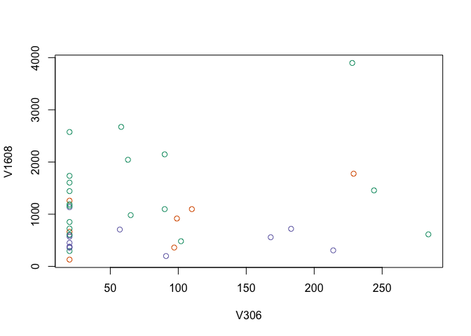

PCA Cancer Analysis
================
Marshall Bradley
4/5/2020

Let’s create a table to see how many samples of each cell we have.

    ## 
    ## ALL-B ALL-T   AML 
    ##    19     7    12

Randomly select two columns and plot them against each
other.

<!-- -->

Run the PCA and plot
it.

<!-- -->

From this plot, we can see that it is probable that sample 22 was
mislabeled as ALL-B, when it should be ALL-T.

Find out how much variation is explained by the first two components.

``` r
sum(pcaOut$sdev[1:2]^2)/sum(pcaOut$sdev^2)
```

    ## [1] 0.3582157

The first two components explain about 36% of the variation.
